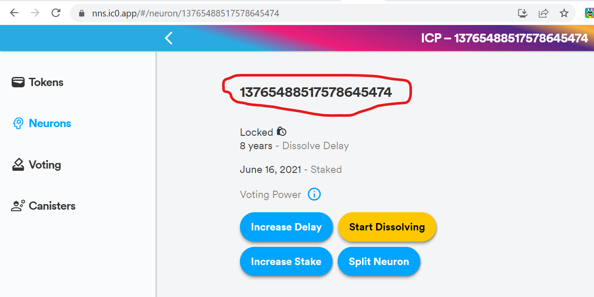
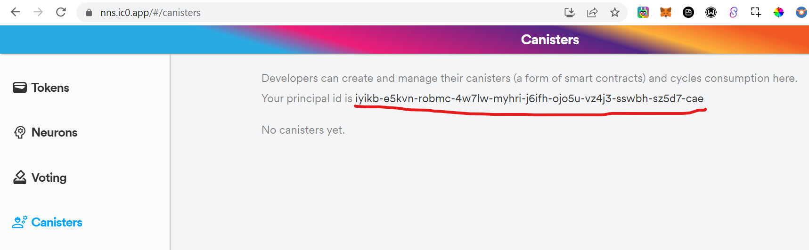
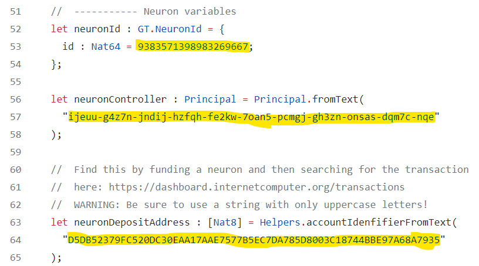
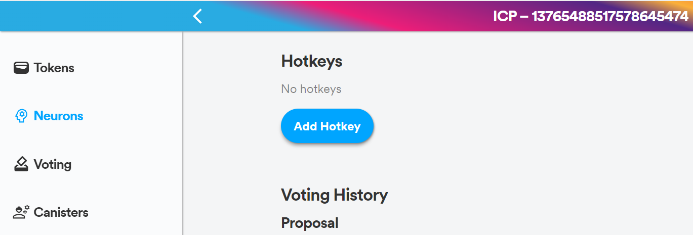

<p align="left" >
  
</p>

# NNS Proposal Submission Dapp

This dapp makes submitting NNS proposals easy for non-technical users with the lowest cost possible. You can find the front end by visiting [nnsproposal.icp.xyz](https://nnsproposal.icp.xyz/) or [uf2fn-liaaa-aaaal-abeba-cai.ic0.app](https://uf2fn-liaaa-aaaal-abeba-cai.ic0.app/). It was created by [Isaac](https://isaac.icp.page/).

## Dependencies

- [dfx](https://smartcontracts.org/docs/developers-guide/install-upgrade-remove.html)
- [npm](https://nodejs.org/en/download/)

## Basic Concepts

### What is the Internet Computer?

The Internet Computer is a novel blockchain that has the unique capability to serve web content while not requiring the end users to use a browser extension, such as Metamask.

Coupled with super fast execution the Internet Computer provides the worlds first truly user friendly Web 3.0 experience.

### What are canisters?

Dapps on the Internet Computer live in canisters, which are special smart contracts that run WebAssembly, and can respond to regular HTTP requests, among other capabilities.

This repository uses Svelte for the frontend running in the browser, and the backend dapp is written in Mokoto, it serves as the business logic of your dapp.

You will build and deploy the following _canisters_:

- `backend` that is written in Motoko, and will hold the business logic of your dapp.
- `frontend` that is your regular Svelte app, transferred into a `frontend asset` canister.

### What is Motoko?

Motoko is a new language designed for the Internet Computer. Easy to learn for JavaScript and Solidity developers. Created by the Motoko team at the DFINITY Foundation, led by WebAssembly co-creator Andreas Rossberg. To learn more about the language, check out the [SDK](https://smartcontracts.org/docs/language-guide/motoko.html).

### What is Internet Identity?

Internet Identity is a new authentication framework similar to Github or Google login, but providing complete anonimity to the users. To learn more about Internet Identity check out the [documentation](https://smartcontracts.org/docs/ic-identity-guide/what-is-ic-identity.html).

## Install dependencies

Make sure you have [node.js](https://nodejs.org/) installed.

### How to get this repo

To clone this repo without downloading the entire repository, run the following command:

```
npx degit https://github.com/InternetComputerOG/NNS-Proposal-Submission-Dapp
```

### Motoko back end

If you're using Visual Studio Code it is recommended to use the [Motoko extension](https://marketplace.visualstudio.com/items?itemName=dfinity-foundation.vscode-motoko) developed by the DFINITY Foundation.

### DFX

Install `dfx` by running

```
sh -ci "$(curl -fsSL https://smartcontracts.org/install.sh)"
```


## Build & Deploy

Make sure you are at the project root directory.

First, install the frontend dependencies by running

```
cd src/frontend
npm install
cd ..
```
To host the frontend and backend on the IC, you'll need to have some cycles available. Cycles pay for the execution of your app, and they are also needed to create canisters.

If you need help getting cycles to deploy to the network, [here are some instructions](https://docs.google.com/document/d/1dEnl5qepCSLk5JD1EChdXBs38oVSH475Cb0KPVNE4jQ/edit?usp=sharing).

You should have a canister running the cycles wallet on the IC at this point. The cycles wallet makes it easy to pay for canister creation.

You can check the balance by running

```
dfx wallet --network ic balance
```

After making sure you have cycles available you can run

```
dfx deploy --network ic
```

## Configuring the Proxy Neuron

This dapp needs to be connected to a neuron, because only neurons can submit proposals!

### 1. Create a neuron

Create a neuron using the [NNS App](https://nns.ic0.app/) and set a dissolve delay of at least 6 months so that it qualifies for sending proposals. Here is [step-by-step guide](https://medium.com/infinityswap/staking-your-icp-everything-you-need-to-know-90780d421640) you can use for this step.

### 2. Hard-Code Neuron Info

The dapp needs this information:
- Neuron ID
- Neuron Controller Principal
- Neuron Deposit Address

You can find the Neuron ID within the [NNS App](https://nns.ic0.app/) here:
<p align="left" >
  
</p>

You can find the Neuron Controller Principal within the NNS App here:
<p align="left" >
  
</p>

To find the deposit address, first use the NNS App to increase the stake of the neuron. Then copy your NNS ICP Wallet Address from the Token page, and paste it into the search bar at the top of the [Internet Computer Dashboard](https://dashboard.internetcomputer.org/) website. You'll see a list of transactions, the deposit address will be in the "To" field of the most recent transaction.

**IMPORTANT**: Make sure you convert the Neuron Deposit Address to uppercase letters (all caps) before pasting it into the dapp.

Once you've collected all of this information, open up [main.mo](src/backend/main.mo) and change the information found in these fields:
<p align="left" >
  
</p>

Remember to re-deploy your dapp at this point to make sure these changes go live.

### 3. Add backend canister as a Hot Key

You can find the backend canister ID (principal) in the canister_ids.json file that DFX generated when deploying your dapp. Then go back to your neuron in the NNS App and add this principal as a Hot Key for your neuron.
<p align="left" >
  
</p>

At this point, you're dapp is fully configured and ready to publish proposals!